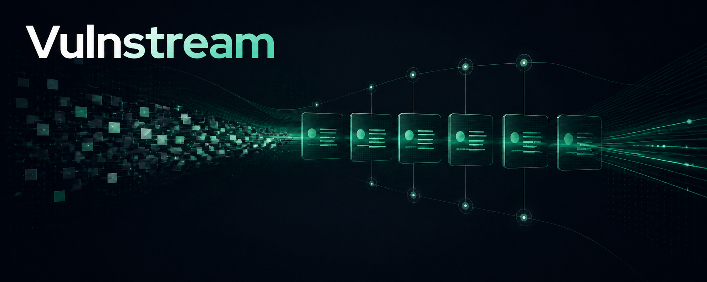

# Vulnstream



**Dependable change-data infrastructure for vulnerability intelligence.**

Observe every publication. Preserve the evidence. Deliver every meaningful
change.

Vulnerability programs should not have to rebuild polling, comparison ledgers,
reconciliation jobs, replay logic, and delivery evidence for every upstream
source. Vulnstream turns continuously changing vulnerability intelligence into
normalized semantic events that downstream systems can trust and recover.

> Vulnstream is a vulnerability-event infrastructure product with an explorer,
> not an explorer product with webhooks.

## From publication to proof

```text
Observe  →  Preserve  →  Normalize  →  Reconcile  →  Replay  →  Prove delivery
```

| Product guarantee | What downstream teams receive |
| --- | --- |
| **Meaningful change** | Stable, typed events for material vulnerability changes—not arbitrary document churn. |
| **Immutable provenance** | Every normalized version remains connected to the source revision, raw record, hash, and observation time that produced it. |
| **Recoverable history** | Consumers can replay from a durable event record instead of depending on a transient delivery channel. |
| **Verifiable delivery** | Deterministic identities, signed payloads, retry history, and retained attempts make delivery inspectable. |

## Built for security systems that cannot miss a change

Vulnstream is for application-security, vulnerability-management, product-
security, and security-platform teams that move public vulnerability
intelligence into internal automation.

- **Source operations:** checkpointed observation, reconciliation, quarantine,
  and exact raw-source retention.
- **Change intelligence:** canonical versions and semantic events for
  publication, lifecycle, severity, affected-product, reference, KEV, and
  package-identity changes.
- **Delivery infrastructure:** filtered subscriptions, signed webhooks,
  retryable dispatch, durable replay, and attempt-level evidence.
- **Investigation:** an explorer for records, provenance, timelines, and
  integration contracts without making the user interface the system of
  record.

## Private-alpha status

The working private alpha includes a production-candidate CVE List V5
connector, historical reconstruction, deterministic event generation, durable
replay, signed webhook delivery, and a browser explorer. Full-history local
reconstruction has been used to validate the model; it is not presented as a
hosted availability or service-level result.

Vulnstream is not yet a public hosted service. Availability, commercial terms,
and design-partner access have not been announced. The core product repository
remains private during alpha.

## Trust and participation

- Read the organization [security policy](../SECURITY.md) before reporting a
  vulnerability or other sensitive behavior.
- Follow the [support guidance](../SUPPORT.md) for non-sensitive product
  feedback and questions.
- Review the [contribution expectations](../CONTRIBUTING.md) and
  [code of conduct](../CODE_OF_CONDUCT.md) before participating in a repository
  that accepts public contributions.

Do not put credentials, private exploit details, customer data, package
inventories, or sensitive infrastructure information in a public issue.

## Source attribution and independence

Vulnstream is an independent product. It is not affiliated with, endorsed by,
or certified by the CVE Program, The MITRE Corporation, CISA, or any other
upstream publisher.

Vulnstream works with [CVE Records](https://www.cve.org/) under the
[CVE Program Terms of Use](https://www.cve.org/Legal/TermsOfUse) and with the
[CISA Known Exploited Vulnerabilities Catalog](https://www.cisa.gov/known-exploited-vulnerabilities-catalog),
which CISA distributes under
[CC0 1.0](https://github.com/cisagov/kev-data/blob/develop/LICENSE). CVE is a
trademark and the CVE logo is a registered trademark of The MITRE Corporation.
Third-party marks and source names identify their owners; no endorsement is
implied.
